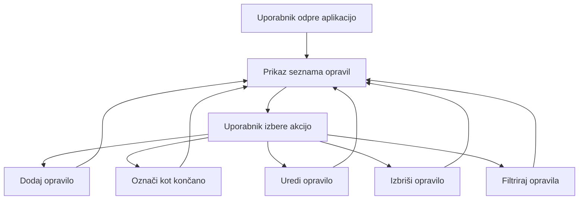

# ToDo App

ToDo App je spletna aplikacija za upravljanje opravil, razvita kot del učne naloge. 
Projekt je sestavljen iz **Spring Boot** backend-a, **Node.js/Express** frontend-a in **MySQL** podatkovne baze. 
Aplikacija omogoča ustvarjanje, urejanje, označevanje dokončanih opravil ter brisanje opravil.

---

## 1. Dokumentacija za razvijalce

### Projektna struktura

todo-app/<br />
│<br />
├─ backend/ # Spring Boot REST API<br />
│ ├─ src/main/java/... # Kontrolerji, servisi, modeli, repozitoriji<br />
│ ├─ src/main/resources/ # application.properties (povezava na MySQL)<br />
│ └─ pom.xml # Maven odvisnosti in konfiguracija<br />
│<br />
├─ frontend/ # Node.js + Express strežnik<br />
│ ├─ public/ # Statične datoteke (HTML, CSS, JS)<br />
│ ├─ views/ # EJS predloge (če uporabljene)<br />
│ ├─ package.json # Node odvisnosti<br />
│ └─ server.js # Vstopna točka frontenda<br />
│<br />
└─ docker-compose.yml # (Opcijsko) Docker orkestracija<br />

### Tehnologije in verzije

| Tehnologija | Verzija | Namen |
|------------|---------|--------|
| Java | 17+ | Poganjanje backend aplikacije |
| Spring Boot | 3.x | Backend REST API |
| Node.js | 18+ | Frontend strežnik |
| MySQL | 8.x | Relacijska podatkovna baza |
| Maven | 3.x | Upravljanje odvisnosti backend |
| npm | 9.x | Upravljanje odvisnosti frontend |

### Standardi kodiranja
- Backend uporablja **MVC arhitekturo** (Controller → Service → Repository).
- Komunikacija frontenda in backend-a poteka prek **REST API**.
- Logika in viri so ločeni po nivojih in modulih.

---

## 2. Navodila za namestitev

### Predpogoji
Pred zagonom potrebujete:
- Java 17+
- Node.js 18+
- MySQL 8+
- Maven
- Dostop do terminala

### 2.1. Ustvarite podatkovno bazo

V MySQL zaženite:

```sql
CREATE DATABASE todo_app;
```
Nato v backend/src/main/resources/application.properties nastavite:


spring.datasource.url=jdbc:mysql://localhost:3306/todo_app
spring.datasource.username=VAŠ_UPORABNIK
spring.datasource.password=VAŠE_GESLO
spring.jpa.hibernate.ddl-auto=update

### 2.2. Zagon backend strežnika
cd backend
mvn spring-boot:run
Backend bo tekel na:

http://localhost:8080<br />
### 2.3. Namestitev in zagon frontenda
bash
Kopiraj kodo
cd ../frontend
npm install
npm start
Frontend bo na naslovu:

http://localhost:3000<br />
## 3. Navodila za razvijalce (prispevanje)
Fork-aj repozitorij na GitHubu

Ustvari novo vejo:

git checkout -b feature/ime-funkcije
Naredi spremembe in commite:

git commit -m "Dodana nova funkcionalnost"
Push:

git push origin feature/ime-funkcije
Odpri Pull Request

Pravila prispevanja
Ne briši obstoječe funkcionalnosti brez utemeljitve.

Pred PR preveri, da sistem teče brez napak.

Koda naj bo berljiva in strukturirana.

## 4. API (osnovni endpoints)
Metoda	Endpoint	Opis
GET	/api/todos	Pridobi vsa opravila
POST	/api/todos	Dodaj novo opravilo
PUT	/api/todos/{id}	Posodobi določeno opravilo
DELETE	/api/todos/{id}	Odstrani opravilo

## 5. Vizija projekta

Vizija projekta Todo aplikacije je uporabnikom omogočiti enostavno, pregledno in učinkovito upravljanje njihovih nalog v vsakodnevnem življenju. Aplikacija omogoča ustvarjanje, urejanje, pregledovanje, filtriranje in dokončanje nalog na intuitiven in odziven način.
Cilj aplikacije je izboljšati organizacijo in produktivnost uporabnika tako, da mu pomaga ohranjati pregled nad obveznostmi ter zmanjšati stres, ki nastane zaradi pozabljanja nalog. Aplikacija je zasnovana tako, da je preprosta za uporabo, vizualno prijetna in dostopna na različnih napravah.
Aplikacija je namenjena:<br />
 - študentom, ki želijo spremljati šolske obveznosti,<br />
 - zaposlenim, ki želijo organizirati delovne naloge,<br />
 - posameznikom, ki želijo strukturirati vsakodnevna opravila.<br />
S tem aplikacija podpira boljšo osebno organizacijo in izboljšuje produktivnost na preprost in jasen način.

## 6. Besednjak
| Izraz                 | Pomen                                                                                    |
| --------------------- | ---------------------------------------------------------------------------------------- |
| **Todo**              | Posamezna naloga ali opravilo, ki ga uporabnik želi spremljati.                          |
| **Seznam nalog**      | Prikaz vseh nalog, ki jih je uporabnik ustvaril.                                         |
| **Aktivna naloga**    | Naloga, ki še ni bila označena kot opravljena.                                           |
| **Opravljena naloga** | Naloga, ki jo je uporabnik označil kot končano.                                          |
| **Opis naloge**       | Dodatni opis, komentar ali opomba, povezana z nalogo.                                    |
| **Status naloge**     | Lastnost, ki označuje ali je naloga dokončana ali ne.                                    |
| **Filtriranje**       | Funkcionalnost, ki omogoča prikaz samo določenega tipa nalog (npr. opravljene, aktivne). |
| **API**               | Vmesnik med frontendom in backendom za izmenjavo podatkov.                               |
| **Backend**           | Strežniški del aplikacije, ki upravlja podatke in poslovno logiko.                       |
| **Frontend**          | Uporabniški del aplikacije, kjer uporabnik vidi in uporablja aplikacijo.                 |

## 7.DPU


    G --> B
    H --> B
